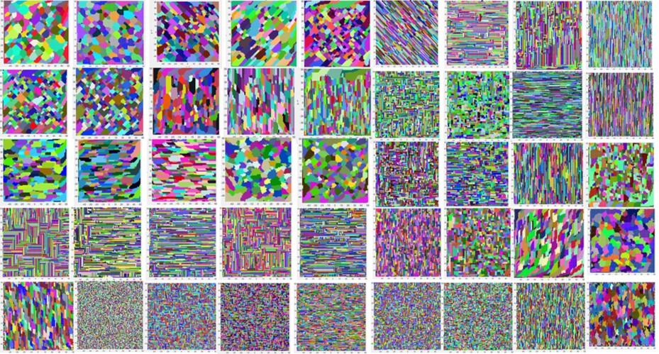

---
title: 'PXO (Poly-XTAL Operations): MATLAB codebase to generate and analyse complex 2D grain structures '
tags:
  - grain structure generation
  - texture and grain structure
authors:
  - name: Sunil Anandatheertha
    orcid: 0000-0001-6535-8191
    affiliation: "1"
affiliations:
 - name: Coventry University, Priory street, Coventry, United Kingdom, CV1 5FB
   index: 1
date: 07 January 2021
bibliography: paper.bib

---

# Summary
Mathematicians, statistical mechanists and computational materials scientists are interested in studying the spatiotemporal evolutionary aspects of multi-phased partitioning of an n-dimensional space. Four examples for this are given. The 1st example is from mathematics where researchers are interested in the chaotic partitioning of an n-D bounded spatial domain and its spatiotemporal evolution under some governing rules. The 2nd example is from statistical mechanics, the very well-known Ising model of the importance sampling Monte-Carlo techniques studying the spatiotemporal evolution of the kinetics and thermodynamics of the distribution of two phases in a lattice. Exact solutions have been developed for such simple models involving 2 states [@Baxter1989], but for more complex models like the Q-state Pott’s model, an exact model is impractical due to the vastness of the solution space. The 3rd example is from fundamental computational materials science where researchers are interested in grain growth [@Weaire1996], where the temporal evolution of the spatial and thermodynamical parameters of multi-phase grain structures [@Anderson1984], [@Anderson1989] is studied. A part of this research also touches upon understanding the kinematic and kinetic behaviour of insoluble 2nd phase particles in grain structures [@Srolovitz1984] and how they interact with the grain boundaries. Some of these studies have tried to validate empirical models of grain structure geometry such as the Zener equation [@Manohar1998]. As the shape of the particles influence the Zener drag working against grain boundary evolution during grain growth [@Li1990], and that nature presents irregularly shaped particles, computer models which can consider such particle shape and their spatial distribution becomes very essential. The 4th example is from applied computational materials science where researchers need poly-crystalline grain structures to be used in techniques such as crystal plasticity based finite element analysis in order to study material’s phase-partitioned thermo-mechanical response and texture evolution under applied thermo-mechanical loads [@Roters2010]. 

Though Voronoi tessellated geometries of grain structures have been used before in crystal plasticity-based simulations, they are simplifications and do not accurately represent the geometric irregularities presented by nature. 'PXO' is mainly targetted at the materials science research community, where computational materials scientists studying multi-scale thermo-mechanical and texture behaviour of poly-crystalline materials need parametric and realistically tessellated geometric morphologies of the constituent phases reflected in the virtual grain structure. They use such grain structures as an input to further studies such as crystal plasticity based finite element analysis. It is difficult to generate such parametric spatially gradient grain structures with multiple temporally low gradient slices as commonly observed in the real world. 'PXO' enables users to create and analyse such grain structures, which may evolve in the temporal dimension in the presence of second phase particles. PXO is also useful for computational geologists. In addition to various in-built tools, 'PXO' can output the grain structure in a format which can be further opened in 3rd party open source libraries to tend to their specific requirements. 'PXO' presents a single platform  offering such functionalities.

# Documentations
All documentations and test cases are available in the [PXO/Wiki](https://github.com/SunilAnandatheertha/PXO/wiki).

# Example grain structures

Above figure shows some sample grain structures which can be generated using PXO. Test case inputs needed to produce them are in the page [Wiki/TestCases](https://github.com/SunilAnandatheertha/PXO/wiki/Test-cases)

# Acknowledgements

The author acknowledges the computational resource offered by the institutions Indian Institute of Science during 2013-2014, PES University during 2014-2017 and Coventry University during 2017-2021. The author also acknowledges Dr. Kishore T Kashyap (Department of Mechanical Engineering, PESIT (now called as PES University), Bengaluru, India, in 2010) for his theoretical inputs on general grain growth, Dr. G Narayana Naik (Department of Aerospace Engineering, Indian Institute of Science, Bengaluru, India) and Dr. N G Subramania Udupa (Nagarjuna College of Engineering and Technology, Bengaluru, India) for supervising the author’s master’s project in 2012-2014.

# References
